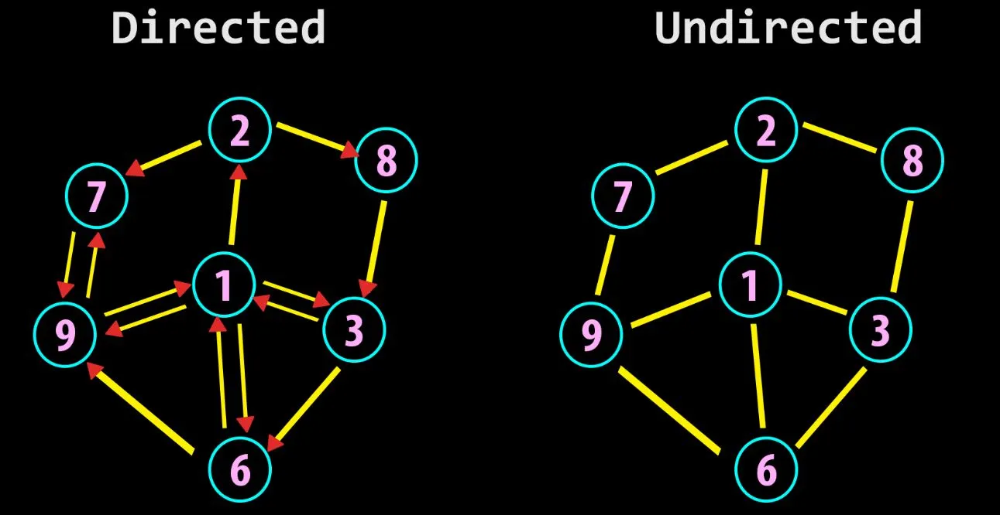
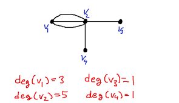
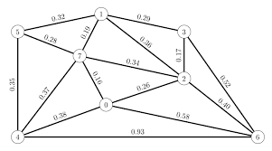

# Introduction
**Directed/Undirected Graph** : if all the edges are directed, it is directed graph. if it has none, it is undirected  

  

## Graph Navigation Types

**1. Walk (Any Route)**
A route is called a walk when it is just a general sequence of connected vertices and edges where you can repeat vertices and edges as much as you want.

**Example**: `A -> B -> C -> B -> A -> B`

**2. Trail (No Repeated Edges)**
A walk becomes a trail the moment you enforce that no edge can be used more than once, though you are still allowed to visit the same vertex multiple times.


**Example**: `A -> B -> C -> D -> E -> B` (Vertex `B` is visited twice, but no physical edge is repeated).

**3. Path**
A trail becomes a path when you enforce stricter limitations on repeating components, which are split into two core types:

* **A. Simple Path** -
A **simple path** is a route where no vertices are allowed to repeat at all, making it a direct route with zero looping or backtracking.


  **Example**: `A -> B -> C -> D`

* **B. Cyclic Path (Cycle)** -
A **cyclic path** is a variation where the route loops back on itself, meaning **a vertex can reappear, but it should be same as the first vertex**.


  **Example**: `B -> C -> D -> E -> B`

  **Example**: `A -> B -> C -> D -> E -> B`
is a trail (not cyclic path) coz the node appeared twice but its not same is starting node of the path.
But if we have to comment the graph(not path) seen in this example then since it has a loop/cycle it is a Cyclic Graph.


## Graph Structural Types

Graphs are categorized based on their structural connections, specifically regarding loops and edge directions.

### 1. Cyclic Graph
A **cyclic graph** is a graph that contains **at least one cycle**. This means there is at least one path where you can start at a vertex, travel through unique intermediate vertices, and end up back at the starting vertex.

**Example**: A network of 4 nodes connected in a square ring (`A-B-C-D-A`).

### 2. Acyclic Graph
An **acyclic graph** is a graph that contains **zero cycles**. No matter which vertex you start from, it is physically impossible to find a path that loops back to that same vertex without turning around and retracing your steps.

**Example**: A family tree structure or a folder directory system (often called a *Tree* or a *Directed Acyclic Graph / DAG*).

### 3. Directed Graph (Digraph)
A **directed graph** features edges with arrows that restrict travel to a specific one-way direction.

**Example**: `A → B` (You can travel from A to B, but not from B to A).

### 4. Undirected Graph
An **undirected graph** features edges without arrows, allowing bidirectional travel back and forth between vertices.

**Example**: `A — B` (You can travel freely from A to B, or from B to A).

### 5. Minimum Edges Required to Form a Cycle
The minimum number of edges required to create a cycle depends entirely on whether the graph allows bidirectional travel or forces a one-way direction.

* #### Undirected Graph (Minimum: 3 Nodes)
  An undirected graph requires a minimum of **3 nodes** to form a cycle. With only 2 nodes (`A — B`), you cannot close a loop without instantly tracing backward over the exact same connection. You need a third node to create an open route back to the start.

  ```text
           A
          / \
         /   \
        B ——— C  
    (3 nodes, 3 edges)
  ```

* #### Directed Graph (Minimum: 1 Node)
  A directed graph requires a minimum of only **1 node** to form a cycle. A single node can point an arrow directly back into itself (known as a self-loop), closing a cycle instantly.

  ```text
        ┌───┐
        │   ↓
        └── A   
    (1 node, 1 edge)
  ```
## Degree of Nodes and Graphs
### 1. Degree Of a Node
The degree of a node is nothing but the no. of edges connected to that node.
* In Undirected Graph - It is simply the total count of the edges passing from a node. You can say the total no. of nbrs of that node.

* In Directed Graph - it is the sum of In-degree and Out-degree of that node.
  * In-degree - the total number of incoming edges to that node.
  * Out-degree - the total number of outgoing edges from that node.

### 2. Degree of a Graph
The degree of a graph refers to the sum of degrees of all the nodes of that graph. It is always equal to **2 times the number of Nodes(N) for every/any graph.**

**Example**: 



**Example**: 
  ```text
        ┌───┐
        │   ↓
        └── A   
    (In-Degree = ?)
    (Out-Degree = ?)
    [Total should be 2*1 = 2]
  ```

## Edge Weights
Every Edge of a graph signifies a cost/weight always. if its not given then it is 1 or k for every edge.

