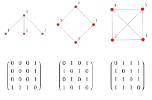
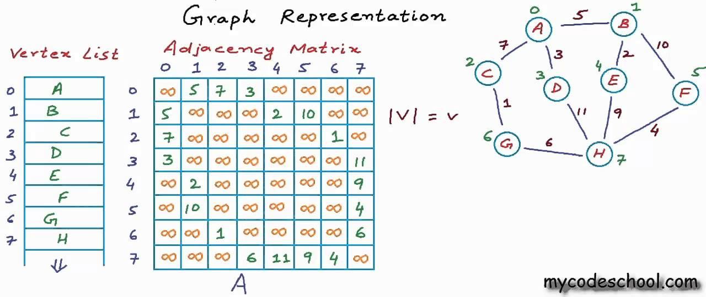

## Definition of a Graph
Graph is a 2-tuple Entity, V and E, where V is set of Vertices and E represents the set of Edges.
* for Directed Graph - E is the set of ordered pairs of vertices.
* for Undirected Graph - E is set of unordered pairs of vertices.
    G = {V , E}

## Representations 
Both V and E can be represented (or given to us) as a set or vector.
And the pairs also can be represented as tuple, set, vectors of two or the pair(keyword).

**TO DENOTE V OR E OR BOTH, WE WILL BE USING MOST OF THE TIME VECTOR OF VECTORS, OR SOMETIMES VECTOR OF PAIRS.**

***TIP**: always use m to tell the size of edges and n to denote the no. of nodes.*

### 1. Adjacency Matrix
---
It is a n*n matrix to denote presence and absence of a node as a neighbour to all others. It can also represent the weights on the edges.
Use `int graph[n][n]` or `vector<vector<int>> graph(n,vector<int>(n,0)` during initialization.

**In case of Unweighted graphs, since we just need to denote the presence and absence we can use boolean.**

**But we can use `INT_MAX` to denote absence so that 1 represents not just the presence but also the weights (ie one). This will make the graph implementation similar to weighted also..** 

**Here if a cell is finite that means the edge is weighted with `w = node[x][y] = node[y][x]` so no need to use 1 just to tell its existence**

**A cell can be sometimes 0 as well to tell that the travel between the nodes is free of cost. but it doesnt mean absence of that edge coz for absence we denote it using `INT_MAX`**

    time complexity : O(n^2 + m) = O(n^2)
    O(n^2) for initializing the matrix of n*n
    O(m) for updating cells [m cells for directed and 2m for undirected]  

and the range of m is `[0 , n*(n-1)/2]` (or `[0 , n*(n-1)]` for directed graphs), so when $m \approx n^2$ in a dense graph, the worst time complexity to traverse edges or say to update cells scales to O(n^2) But in a sparse graph `m ≈ O(n)`.

    space complexity : O(n^2) 

### 2. Adjacency List
---
An adjacency list is a structure where each node index acts as a pointer to a dynamic container (like a vector or lists), storing only the nodes it shares an edge with, along with their optional weights.

* **For Unweighted Graphs**: `vector<int> adj[n];` or `vector<vector<int>> adj(n);` 
* **For Weighted Graphs**: `vector<pair<int,int>> adj[n];` or `vector<vector<pair<int,int>>> adj(n);`

Instead of allocating space for absent edges, we only push existing connections using `adj[u].push_back(v)`. For weighted graphs, we push the pair `adj[u].push_back({v, weight})`.

    time complexity : O(n + m)
    O(n) for initializing an empty list/vector for each of the n nodes
    O(m) for inserting all edges into the lists [m insertions for directed, 2m for undirected]

**Unlike the matrix approach, traversing all the neighbours of a specific node takes only $O(\text{degree of that node})$ time instead of checking all $n$ elements.**

    space complexity : O(n + m)
    O(n) space for the n nodes
    O(m) space to store the actual edge nodes [m elements for directed and 2m for undirected]

---

## Adjacency Matrix vs. Adjacency List: Which is Better?

Choosing between a matrix and a list depends entirely on the **density of the graph** and the **operations** your algorithm needs to perform most frequently.

### 1. Matrix vs. List Comparison Matrix

| Feature / Operation | Adjacency Matrix | Adjacency List | Winner |
| :--- | :--- | :--- | :--- |
| **Space Complexity** | $O(n^2)$ | $O(n + m)$ | **List** (for sparse graphs not dense) |
| **Time to Initialize** | $O(n^2)$ | $O(n + m)$ | **List** |
| **Check if Edge $(u, v)$ Exists** | $O(1)$ (Instant lookup) | $O(\text{degree}(u))$ (Must scan list) | **Matrix** |
| **Find All Neighbors of Node $u$** | $O(n)$ (Must scan entire row) | $O(\text{degree}(u))$ (Only scans neighbors) | **List** |
| **Add a New Edge** | $O(1)$ | $O(1)$ (Using `push_back`) | **Tie** |
| **Delete an Existing Edge** | $O(1)$ | $O(\text{degree}(u))$ (Must search and erase) | **Matrix** |

---

### 2. When to Use Which?

#### Use an Adjacency Matrix if:
* **The Graph is Dense**: The number of edges ($m$) is close to the maximum possible ($n^2$). If $m \approx n^2$, both structures use $O(n^2)$ space, but the matrix gives you faster lookups.
* **Frequent Edge Lookups**: Your algorithm constantly asks: *"Is node X connected to node Y?"* (e.g., Floyd-Warshall All-Pairs Shortest Path algorithm).
* **The Graph is Small**: For a small number of nodes, a matrix is easier to implement and has great CPU cache locality.

#### Use an Adjacency List if:
* **The Graph is Sparse**: The number of edges is small ($m \ll n^2$). This is true for most real-world networks (like Facebook, where you are only connected to a tiny fraction of all users).
* **Frequent Neighbor Traversals**: Your algorithm needs to visit every neighbor of a node one by one (e.g., Breadth-First Search (BFS) or Depth-First Search (DFS)). 
* **The Graph is Large**: If $n = 10^5$, an adjacency matrix requires $10^{10}$ integers (around 40 GB of RAM), which will crash your program. An adjacency list will only scale with the actual connections.
